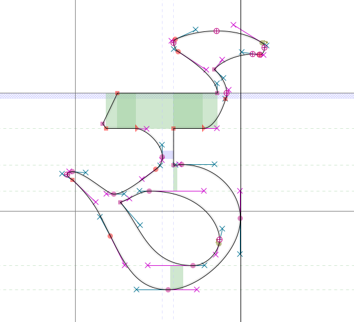
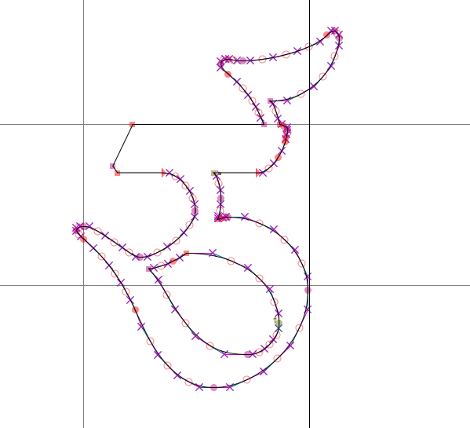
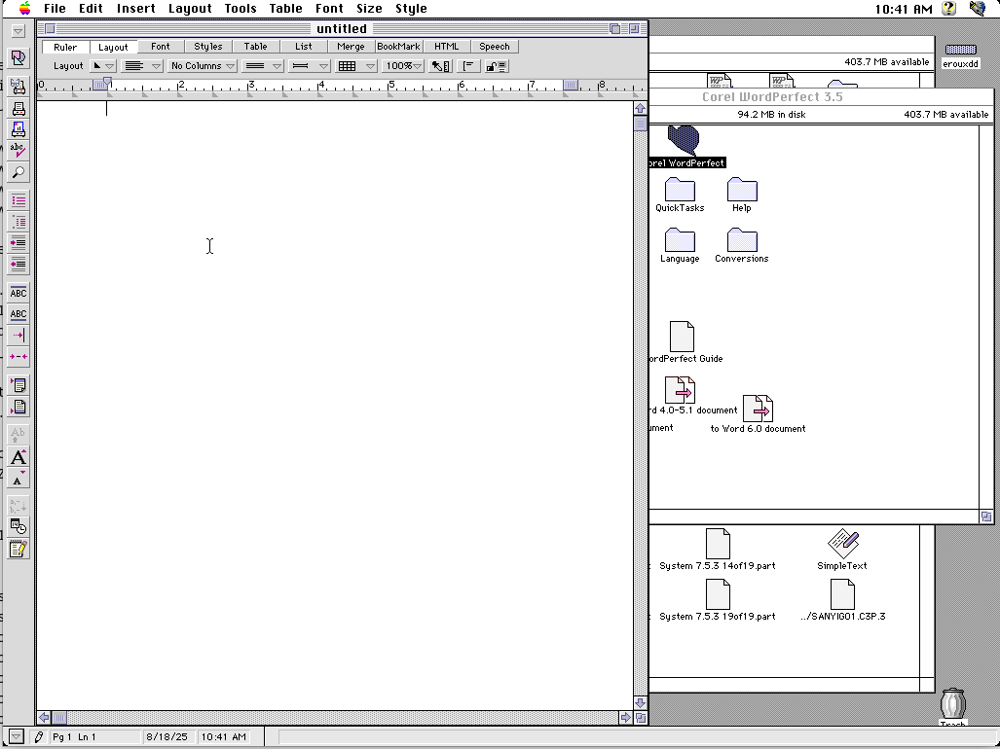

+++
date = '2025-08-18T10:52:53+02:00'
draft = false
title = 'Report from the digital field: archeology and WordPerfect 3.5'
tags = ['fonts', 'OCR']
slug = 'wordperfect-file-extraction'
categories = ['fonts']
image = "thumbnail.png"
#ShowShareButtons = true
[params]
  author = ['Elie Roux']
  post_meta = ["author", "date", "categories", "translations"]
  showtoc = true
  tocopen = true
[[thumbnail]]
  src = "thumbnail.png"
  visibility = ["list"]

showToc = true
[cover]
    image = "thumbnail.png"
    caption = "It is still possible to run Corel WordPerfect 3.5 thanks to the amazing preservation work of Internet Archive"

images = ["thumbnail.png"]

#cover = "cover.jpg"
#thumbnail="posts/20250814/thubmnail.jpg"
+++

BDRC is always active behind the scenes to foster a collaborative and passionate network of institutions and individuals providing practioners, scholars and translators with the material they need.

The story of this blog post starts in the mid-1990s, when a project was undertaken by His Eminence Khochhen Tulku (b. 1937) in Dehradun to publish the Collected Works of the great master Terdak Lingpa (1646-1714). The project resulted in an impressive 16 volumes publication in 1998, scanned and put online in open access by BDRC under the number [MW22096](https://purl.bdrc.io/resource/MW22096).

BDRC then since OCRed the scans and put the OCR online. While the characters are generally quite well recognized, the pecha layout (not well recognized by OCR systems) makes it quite difficult to use the results directly. In our quest to provide the best etexts, BDRC is working on mitigating this problem in two ways:
- improving the layout detection on the Pecha format so that lines and margins are better handled
- getting access to the original files so that the text can be directly extracted from them (see our work on the [PDF format](https://github.com/buda-base/py-tiblegenc)), as this always gives the best result

Surprisingly, in that case, the original files from the mid-90s were preserved and a sample was sent to BDRC to explore its conversion into Unicode, an entertaining week-end project that we will describe in the rest of this article.

The file was produced using the `Tibetan!` system developed by Tony Duff, sitting on top of WordPerfect. It produces files in the WordPerfect file format with idiosyncratic conventions for pecha layout and pre-Unicode Tibetan typesetting. The file was likely produced on MACOS 7 using WordPerfect 3.5 released in 1996. 

The file references a rare font named *Mangala* that has an interesting history. It is based on the style of calligraphy from Derge, initially made for the publication of the Sungbum of Dilgo Khyentse Rinpoche in 1994 ([BDRC MW21809](https://purl.bdrc.io/resource/MW21809)). It was implemented by Tony Duff and then supported for some time in the tools he created, before the support stopped. A distinctive feature is the unique downwards tsa phru ("flag"), compare for instance Mangala with another font from Tony Duff, Tibetan Chogyal:

The first necessary step of converting the file was thus to get a version of this font. Fortunately one is present in our Tibetan font preservation archive on https://github.com/openpecha/tibetan-fonts (contributions welcome!) so we can see what how the font was encoded or perhaps even open the original file!

The first angle attempt to extract the text was to use an open source library named `libwpd` to extract the text from the document directly. The file is recognized by the library but unfortunately the extracted text is 90% spaces and a few seemingly random Chinese characters. Not good...

Well, let's try to open the file directly! It appears that Mac 7 run very well in an emulator (Basilisk II) on a modern Linux system, after a surprisingly small amount of effort. The CD-ROM of WordPerfect 3.5 is preserved by our friends Internet Archive [here](https://archive.org/details/wp-3.5).

Unfortunately, this turned out to be another dead end: the font installation didn't seem to work, I could not find the `Tibetan!` macros, and the file generally did not show any content. Another few hours later, it was time to go back to hacking...

While ChatGPT 5 was an immense help for the effort so far (it was excellent at analyzing the file and proposing solutions to open it), the next part couldn't have happened without it... we're thankful to these models for not getting discourages and have a sufficient knowledge in many domains to help us on things we would otherwise not have the time to do!

So, after assigning a few Copilot agents to various tasks to modify the C++ code (which the author does not have any experience with!), and a few dead ends, I was finally able to export the original text!

In the end, the changes needed were really small (just a few lines)... “The mountain labored and brought forth a mouse” as we would say in French...

But that's not the end! The output is still in a pre-Unicode encoding and we now have to use the font to translate it into Unicode. Fortunately for the most part, the encoding is quite similar to the usual font encoding of the tools by Tony Duff, so the adaptation was not too difficult.

Unfortunately, the Tibetan characters used to represent Sanskrit words and mantras do not follow the usual encoding and a mapping will have to be produced for them... The scans will help that task a lot but that will be for another day.

We hope our work was helpful and that the entirety of this precious publication can be extracted and made available in the future!