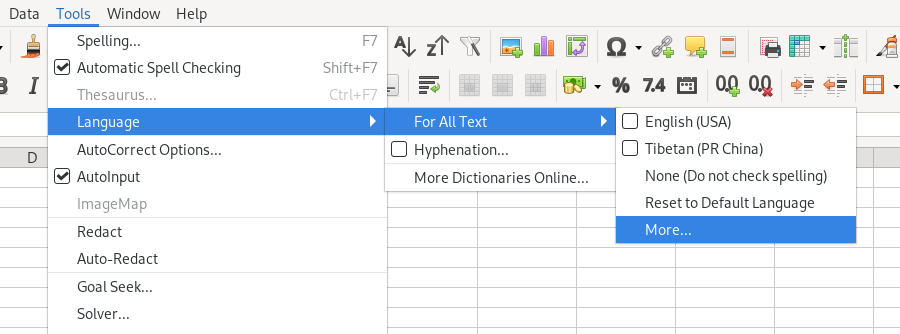
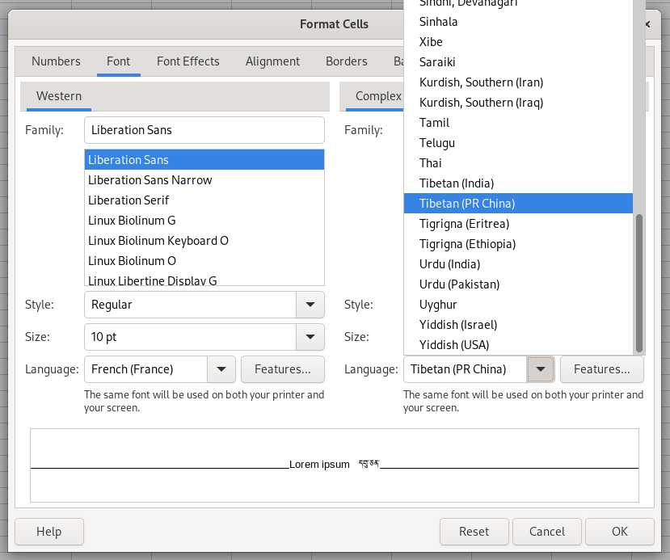
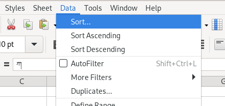
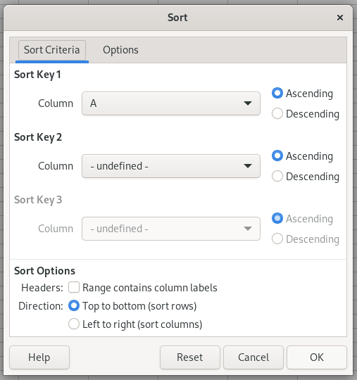

+++
date = '2025-09-15T10:52:53+02:00'
draft = false
title = 'Sorting Tibetan in LibreOffice'
tags = []
slug = 'sorting-tibetan-in-libreoffice'
categories = []
#ShowShareButtons = true
[params]
  author = ['Elie Roux']
  post_meta = ["author", "date", "categories", "translations"]
  showtoc = false
  tocopen = true

+++

Here is a quick tip to sort Tibetan in a recent LibreOffice using the rules created by BDRC (see [blog post about the sorting app](../tibetan-alphabetical-order/) for the context). First, download and install a recent LibreOffice, we tested version 25.8 on Linux, this should work on other platforms too.

The most important part is to set the language of the document to Tibetan (PRC) or Tibetan (India), here's a method you can use: click on

```
Tools -> Language -> For all text -> More...
```



then in the "Complex" part of the screen, select "Tibetan (PR China)" as the language:



Then the Tibetan sorted is activated, using the sorting rules contributed by BDRC. You can test it by copy-pasting

```
ཀ
ས
སྐ
```

in your document as 3 different rows in column A, then sorting them by clicking on

```
Data -> Sort
```



and then leave the default values, click ok:



and the data should now be sorted as

```
ཀ
ས
སྐ
```