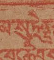
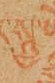

+++
date = '2025-09-16T10:52:53+02:00'
draft = false
title = 'Tibetan Unicode normalization'
tags = []
slug = 'tibetan-unicode-normalization'
categories = []
#ShowShareButtons = true
[params]
  author = ['Elie Roux']
  post_meta = ["author", "date", "categories", "translations"]
  showtoc = false
  tocopen = true

+++

In this blog post we will document one of the many wonderful technical things developed in the BDRC-MonlamAI OCR project (that resulted in the [Tibetan OCR desktop app](https://github.com/buda-base/tibetan-ocr-app)).

## Introduction: Tibetan Unicode Normalization?

During our experiments with Tibetan encoders for OCR, we created an encoder based on Tibetan stacks. The idea is the make the model "see" the data in a way that is optimal. An intuition we tested is that it would be useful for the model to "see" Tibetan stacks, or glyphs. For instance

བསྒྲུབས

would be seen as 4 tokens:

བ སྒྲུ བ ས

and each of these tokens would be assigned a code in what is called a vocabulary. For instance if 
- `བ` is assigned code `12`
- `སྒྲུ` is assigned code `879`
- `ས` is assigned code `94`

then བསྒྲུབས would be encoded as `12 879 12 94`.

When we started the so called "Tibetan stack encoder", our first step was to just look at all the stacks in a corpus to see how many there were. We made a list and spotted that something was off. 

Let's take a real example: if we segment the excellent [Esukhia Derge Tengyur](https://github.com/Esukhia/derge-tengyur/) in stacks[^1] and count the frequency of each stack, we see that some stacks appear multiple times in the list:

```
བྷྲྀཾ,20

བྷྲྀཾ,3

བྷྲྀཾ,1

བྷྲཾྀ,1
```

For instance the same stack བྷྲྀཾ appeared as 4 different stacks on our list[^1]... Weird, let's dissect these 4 versions of the stack by looking at the sequence of Unicode characters[^2]:

```
བྷྲྀཾ = 0F56 (བ) 0FB7 (◌ྷ ) 0FB2 (◌ྲ ) 0F80 (◌ྀ ) 0F7E (◌ཾ )

བྷྲྀཾ = 0F57 (བྷ) 0FB2 (◌ྲ ) 0F80 (◌ྀ ) 0F7E (◌ཾ )

བྷྲྀཾ = 0F57 (བྷ) 0F76 (◌ྲྀ ) 0F7E (◌ཾ )

བྷྲཾྀ = 0F56 (བ) 0FB7 (◌ྷ ) 0FB2 (◌ྲ ) 0F7E (◌ཾ ) 0F80 (◌ྀ )
```

So, it appears there are several Unicode character combinations that will be have the same visual representation (that we will call *glyph*). That's not ideal for AI and NLP tasks though, as these will only look at the Unicode characters, not the glyphs. The problem will be that what is the same for humans (looking at glyphs) will be different for machines (looking at the Unicode characters).

So in order to make text processing more accurate, we need to understand how to change our Unicode characters so that one glyph corresponds to only one sequence of Unicode characters. We will call that task Tibetan Unicode Normalization (TUN).

Let's dive into it by looking at the issues we identified during our project. If you're just looking for a quick way to apply TUN on your dataset, you can just use [this function](https://github.com/OpenPecha/Botok/blob/master/botok/utils/unicode_normalization.py#L101).

## 1. Canonically Equivalent(ish) Unicode Forms

### NFC vs. NFD

In the example we used above, we can see two variations:

- `བྷ` is sometimes represented as `0F57` (བྷ), other times as `0F56` (བ) `0FB7` (◌ྷ )
- `◌ྲྀ` is sometimes represented as `0F76` (◌ྲྀ ), other times as `0FB2` (◌ྲ ) `0F80` (◌ྀ )

they correspond to a feature of Unicode that has encoding for *composed* characters, here `0F57` (བྷ) is documented as being canonically equivalent to the sequence `0F56` (བ) `0FB7` (◌ྷ ). The composed form is called *NFC* (Normalization Form C) and the decomposed form *NFD* (Normalized Form D).[^3]

This feature has historical reasons in Latin script but its application to Tibetan is rather difficult to make sense of for the author.

See the Unicode website for [the 20 Tibetan characters that can have this variation](https://unicode.org/charts/normalization/chart_Tibetan.html).

For this case there is no right or wrong representation, but since the compositions are rare and difficult to make sense of, we use the decomposed form in our TUN code.

### The strange case of 0F00

One equivalence of the exact same type is handled differently in Unicode[^4]:

```
0F00 (ༀ) = 0F68 (ཨ) 0F7C (◌ོ ) 0F7E (◌ཾ )
```

Strangely, it does not appear in the Unicode normalization lists, which appears to be an oversight. In 2018, the author investigated the issue[^5] but, stability being a very important feature of Unicode, it unfortunately cannot be changed[^6].

Our TUN system normalizes all occurences to the decomposed form.

## 2. Graphical equivalent

### 0F62 / 0F65

Unicode has two characters to represent the letter ར: `0F62` and `0F65`. The difference between the two is subtle:

- `0F62` is the letter ར we know and love, which becomes a small ra-go when it sits on top of letters like ཀ : རྐ
- `0F65` was created to encode the rare case where ར does not change to its smaller form, eg ཪྐ

One issue is that in many cases, the two Unicode characters lead to the exact same glyph, for instance པར can be represented as `0F54` (པ) `0F62` (ར) or `0F54` (པ) `0F65` (ཪ). Our TUN system thus changes `0F65` to `0F62` in all the cases where they are equivalent.

### More graphical variants

For OCR purposes, more graphical equivalent can be normalized, for instance
- `0F0B` (་) ≅ `0F0C` (༌)
- `0F0E` (༎) ≅ `0F0D 0F0D` (།།)
- `0F38` (༸, honorific sign) ≅ `0F27` (༧, the number seven)
- etc.

Note that these are in a [separate function](https://github.com/OpenPecha/Botok/blob/master/botok/utils/lenient_normalization.py#L253) in our code since in some applications the distinction can make sense.

## 3. Character order

The final issue that needs attention in our system is character order. This is, in a way, a particular case of the graphical variant. The difference here is that there is another component involved in the normalization: layout engines. Layout engines, or text shaping engines, are the core component of any visual rendering of character. They are used in:
- OSs (MS Windows, MacOS, Linux, etc.)
- Word processors (MS Word, LibreOffice, etc.) to render characters
- Web browsers
- etc.

At their core, they have two components as input:
1. a font
2. a sequence of Unicode characters

and output a rendering of the sequence of Unicode characters using the font (in the form of a vector image). Some examples are [Harfbuzz](https://harfbuzz.github.io/) (open source), Microsoft [Universal Shaping Engine](https://learn.microsoft.com/en-us/typography/script-development/use), etc.

Layout engine makers agree on a set of conventions, including some to reorder glyphs before rendering them[^7]. This has the effect that different sequences of characters will be rendered in the same way by layout engines.

The rules for Tibetan are explained on the [Microsoft Documentation on Tibetan rendering](https://learn.microsoft.com/en-us/typography/script-development/tibetan#reor), and consist in reordering the characters into the following (simplified) order:
1. top position consonant
2. sub-joined consonnants
3. sub-joined vowel (a-chung U+0F71)
4. other vowels

This means that if we look at the following sequences:
- `0F40` (ཀ) `0F71` (◌ཱ ) `0F74` (◌ུ ) `0F7E` (◌ཾ ) : ཀཱུཾ
- `0F40` (ཀ) `0F74` (◌ུ ) `0F71` (◌ཱ ) `0F7E` (◌ཾ ) : ཀཱུཾ

will be reordered to and be rendered ཀཱུཾ by the layout engines. All of these variations are thus impossible to distinguish visually and should be normalized.

Our TUN system reorders characters sequences so that they follow the order:
1. top position consonant
2. sub-joined consonants
3. sub-joined vowels (ex: `0F74` ◌ུ )
4. sub-joined marks (ex: `0F37` ◌༷ )
5. top vowels (ex: `0F72` ◌ི )
6. top marks (ex: `0F7E` ◌ཾ )
7. right mark (ex: `0F7F` ◌ཿ )

### over-reordering?

As demonstrated in our previous example, the sequences `0F74` (◌ུ ) `0F71` (◌ཱ ) and `0F71` (◌ཱ ) `0F74` (◌ུ ) have no visual distinction on rendering. But does it mean we should canonicalize them for all tasks?

An argument in favor of not doing that is the presence in some blockprints and manuscripts of unusual stacks with the shabkyu on top of the a chung, for instance in the Lithang Kangyur, volume 96 page 168a:



This is even encoded in that exact sequence in the transcription provided by [Adarshah](https://online.adarshah.org/index.html?kdb=jiangkangyur&sutra=J513&page=96-168a&highlight=%E0%BD%A6%E0%BD%B4%E0%BE%B0): `0F74` (◌ུ ) `0F71` (◌ཱ ). In that particular case, reordering the characters would lead to a loss of information.

Two arguments in favor of the reordering are:
- in the general case, it is unknown whether the sequence `0F74` (◌ུ ) `0F71` (◌ཱ ) really means that the characters are in that order of if the transcribers made a mistake that was invisible to them
- it is unlikely that these unusual stacks have a different semantic than the more regular ones, and are probably oddities in the publications that should be ignored

Our TUN system does not reorder this sequence, so if it is helpful for your task, don't forget to add it!

Another sequence with the same issue is `0F71` (◌ཱ ) `0FB1` (◌ྱ ), found in the Lithang Kangyur, volume 96 page 18a:



## Experiment and conclusion

In our experiment on the Esukhia Derge Tengyur, the Tibetan stack tokenizer found 8,684 stacks before TUN, 8,285 stacks after TUN (+ the additional graphical variant normalization), a reduction of 4.5%. A noticeable improvement, at the low cost of running a couple of Python functions!


[^1]: using [botok](https://github.com/OpenPecha/Botok/)'s simple [stack tokenizer](https://github.com/OpenPecha/Botok/blob/master/botok/tokenizers/stacktokenizer.py)

[^2]: using [Richard Ishida's excellent web app](https://r12a.github.io/app-conversion/index.html)

[^3]: or at least this is true in a first approximation. For more see the [Unicode FAQ on Normalization](https://www.unicode.org/faq/normalization.html) and [Unicode Standard Annex #15, Unicode Normalization Forms](https://unicode.org/reports/tr15/).

[^4]: for more on this character, here is an excerpt from an email from Chris Fynn to the author's inquiry on the Unicode mailing list: "U+0F00;TIBETAN SYLLABLE OM is a leftover of the original encoding of Tibetan script in Unicode (later removed) which, like the encoding of most scripts used in India, was based on ISCII. I think the argument put forward for maintaining U+0F00 as a separate character was that it would ease the lossless 2 way conversion between Tibetan and other Indic scripts like Devanagari which have a unique character for OM."

[^5]: through submission [L2/18-078](https://www.unicode.org/L2/L2018/18078-tibetan-depr.pdf)

[^6]: see [Unicode Stability Policy for Normalization](https://unicode.org/policies/stability_policy.html#Normalization), and [Change Management for the Unicode Collation Algorithm](http://www.unicode.org/collation/ducet-changes.html).

[^7]: see https://learn.microsoft.com/en-us/typography/script-development/use#glyph-reordering